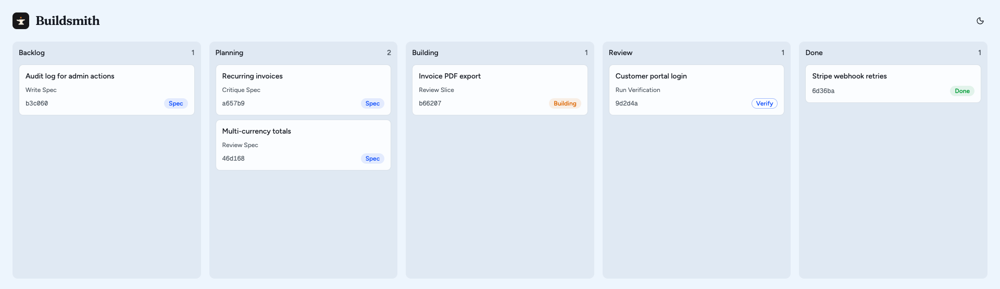
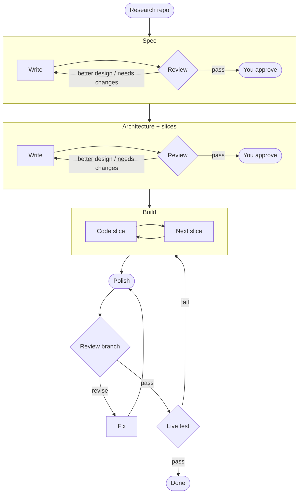
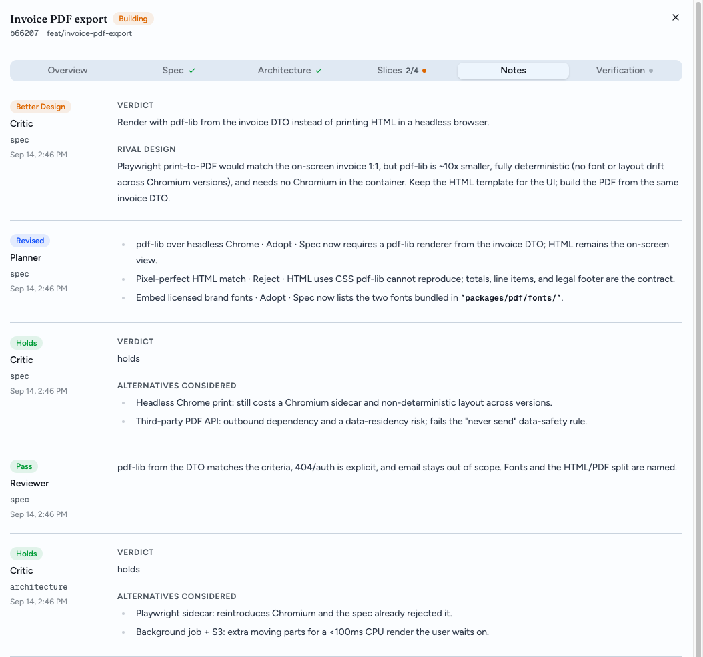

<p align="center">
  
</p>

<h1 align="center">Buildsmith</h1>

<p align="center">
  <strong>A lightweight agentic coding pipeline, enforced by a deterministic state machine over markdown on disk.</strong><br>
  Git-friendly, diffable, human-readable. Never edited by hand; the CLI is the only writer.
</p>

Coding agents are good at steps and bad at processes. They forget the review loop, skip the gate, and grade their own homework. Skills are advice; nothing stops an agent from deciding it has done enough.

Buildsmith moves the process out of the model's head and onto disk. Every task is a folder of markdown. A small CLI reads those files and returns exactly one next step. Agents execute it. They do not choose it.



## Why Buildsmith

- **Deterministic next step.** `buildsmith step` derives what happens next from file state, not from memory. Same files, same answer.
- **No skip.** A draft spec needs a review. A `needs-changes` verdict sends it back. Nothing advances until the role that owns the step records a verdict.
- **Fresh eyes on every review.** Reviewing, coding, polishing, and live-testing are dispatched to a new subagent with one brief and no memory of the last round. The planner never reviews its own work.
- **Two approvals, then it builds.** You approve the spec and the architecture. Everything between approval and a verified feature runs without you, and stops for you when a slice is blocked or a loop hits its cap.
- **Live verification, not just green tests.** The last step runs the real process, exercises every criterion in the spec, and records evidence a skeptic can read.
- **Markdown on disk.** Specs, architectures, slices, notes, and verdicts are plain files under `.buildsmith/`. Diffable, reviewable, `git blame`-able. Never edited by hand; the CLI is the only writer.
- **A plain CLI.** Every command prints JSON. Any agent that can run a shell can drive it.
- **Prompts you own.** Every step is a markdown template. Eject one into your repo and edit it, or append to it and leave the built-in intact.
- **Works where your agent lives.** One command installs the plugin for Cursor, Claude Code, or Codex.

## Install

Requires [Bun](https://bun.sh) 1.4.2 or newer.

```sh
npm install -g buildsmith   # or: bun add -g buildsmith
```

Then install the plugin for the agent host you use:

```sh
buildsmith setup cursor     # or: claude, codex, or all three with no argument
```

Standalone binaries for macOS, Linux, and Windows are on the [releases page](https://github.com/AidenHadisi/buildsmith/releases).

## Quick start

In your repo, tell your agent what you want built:

> Use buildsmith to add PDF export for invoices.

That is the whole workflow. The agent initializes the board, researches the repo once, creates the task, interviews you for the spec, runs the review loop, asks you to approve, designs the architecture and its slices, asks you to approve again, and builds. You are asked twice, and again only if a loop hits its cap.

Under the hood the agent runs one command in a loop:

```sh
buildsmith step invoice-pdf
```

```json
{
  "do": "dispatch",
  "action": "review-spec",
  "readonly": true,
  "model": "claude-opus-5-high",
  "prompt": "Run `buildsmith brief invoice-pdf` and follow it exactly, including its Record section. Return one line."
}
```

Watch it move:

```sh
buildsmith board            # http://127.0.0.1:3000
```

## How it works

Each task is a folder of markdown under `.buildsmith/`. Status lives in frontmatter. `buildsmith step` reads those files and returns one of four things:

| `do`       | What happens                                                                                           |
| ---------- | ------------------------------------------------------------------------------------------------------ |
| `self`     | A brief for the planner: write the spec or architecture with you, rule on a review, ask you to approve |
| `dispatch` | A model, a readonly flag, and a one-line prompt for a fresh subagent. It records its work and returns  |
| `ask`      | A cap was hit. The planner shows you why and stops                                                     |
| `done`     | Every step is complete                                                                                 |

### The pipeline



1. **Research.** A researcher maps the repo once (how to run, check, live-test, deploy, read logs, code conventions) and writes `project.md`. Every later brief pastes it in.
2. **Spec.** The planner interviews you and writes what to build and what done looks like. A fresh reviewer tries to beat it with a tighter spec, then checks it can be built as written. You approve; approval freezes it.
3. **Architecture.** The planner designs components, seams, and key decisions, then cuts the work into ordered slices with pinned contracts, criteria, and tests. A fresh reviewer judges design and cut together. You approve; approval creates the slices.
4. **Build.** One coder per slice, each with the whole architecture and its slice's design. A blocked slice stops for your decision.
5. **Polish, review, verify.** A polisher cleans the diff without changing behavior. A code reviewer passes or sends it back with line-cited findings. A tester runs the real process against every criterion; a failure becomes a fix slice and the loop continues.

Every loop repeats until a fresh reviewer returns `pass`. A rewrite bumps the revision and resets the document to `draft`, so nothing that changed goes un-reviewed.

<p align="center">
  
</p>

### Roles and gates

| Role          | Step                                                    | Runs as  |
| ------------- | ------------------------------------------------------- | -------- |
| Researcher    | `write-project`                                         | dispatch |
| Planner       | `write-spec`, `write-architecture`                      | self     |
| Reviewer      | `review-spec`, `review-architecture`                    | dispatch |
| You           | `approve-spec`, `approve-architecture`, `unblock-slice` | self     |
| Coder         | `work-slice`, `work-branch`                             | dispatch |
| Polisher      | `polish`                                                | dispatch |
| Code reviewer | `review-branch`                                         | dispatch |
| Tester        | `run-verification`                                      | dispatch |

Caps turn into `ask` so a loop cannot run forever: a document at revision 5, a branch sent back 3 times, a verification failed twice, or a dispatched step that returned twice without changing the board.

## The board

`buildsmith board` serves a read-only view of `.buildsmith/` on localhost and opens it in your browser. It refreshes live as files change.

- **Columns** from your config, each task card showing its next action, stage, and any blocked slices or pending question.
- **Task sheet** with tabs for the spec, architecture, verification, slices with progress, and every note with its verdict.
- `--port <n>` picks the port and falls back to a free one; `--no-open` only prints the URL.

## Customize

### Prompts

Each step is a markdown template with frontmatter saying who runs it (`run: self` for the main agent, `run: dispatch` for a subagent) and, for dispatched steps, the model tier and whether it is read-only. Eject one into the repo and edit it, or append to it with an `.extra.md` file and leave the built-in intact.

```sh
buildsmith prompt list                          # every template and where it resolves from
buildsmith prompt eject review-spec             # copy to .buildsmith/prompts/review-spec.md
buildsmith prompt diff review-spec              # your override vs the built-in
# or, without ejecting:
#   .buildsmith/prompts/review-spec.extra.md    # appended under "Repo additions"
```

Shared fragments eject the same way: `standards/spec` and `standards/design` hold the bars every writer and reviewer is held to; `include/task` is the task card on every brief; `include/delegate` is the rule that sends reading and research to parallel subagents.

### Models and columns

Dispatched templates name a tier, `strong` or `fast`. Both default to `inherit`, so subagents run on whatever model your agent is using. Pin either tier to a model id your host understands, once for you in `~/.config/buildsmith/config.yml` (or `$XDG_CONFIG_HOME/buildsmith/config.yml`) or per repo in `.buildsmith/config.yml`. Every key is optional; the repo file wins over the user file, key by key.

```yaml
models:
  strong: claude-opus-5-high
  fast: cursor-grok-4.6-high
columns: [backlog, planning, building, review, done]
```

## CLI

Every command prints JSON. Task ids accept a unique prefix.

| Command                                | What it does                                                  |
| -------------------------------------- | ------------------------------------------------------------- |
| `init [dir]`                           | Create a `.buildsmith` directory                              |
| `setup [cursor\|claude\|codex]`        | Install the plugin for agent hosts                            |
| `step <id>`                            | Decide the next step: `done`, `ask`, `self`, or `dispatch`    |
| `next <id>`                            | Show the next action, its stage, and why                      |
| `brief <id> [action]`                  | Render the prompt for the next action                         |
| `board`                                | Serve the board on localhost                                  |
| `task create\|list\|get\|move\|update` | Manage tasks                                                  |
| `doc write\|read\|status\|result`      | Write, read, and advance the spec, architecture, verification |
| `slice add\|list\|update`              | Manage slices                                                 |
| `note add\|list`                       | Record and read notes and verdicts                            |
| `project read\|write\|lesson`          | Manage `project.md`                                           |
| `prompt list\|show\|eject\|diff`       | Inspect and override prompt templates                         |
| `asset put <id> <file>`                | Attach a file to a task                                       |

Run any command with `--help` for its flags.

## On disk

```
.buildsmith/
  config.yml
  project.md                     # how to run, check, live-test, deploy, conventions
  prompts/                       # optional overrides
  tasks/<slug>/
    task.md                      # title, column, branch
    spec.md  architecture.md  verification.md
    slices/  notes/  assets/
```

Git-friendly, diffable, human-readable. Never edit it by hand; the CLI is the only writer.

## Contributing

Issues and pull requests are welcome. See [CONTRIBUTING.md](CONTRIBUTING.md) for the development setup.

```sh
bun install
bun test
bun run typecheck && bun run check
```

## License

[MIT](LICENSE) © Aiden Hadisi
